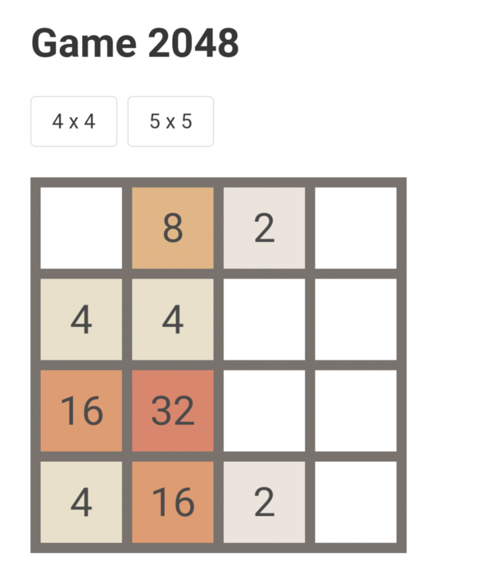

# Game 2048.

Another game that I developed in JavaScript with my son.

## Demo

[Demo Page](https://game2048.onurcinar.repl.co/)

## Usage

Game supports both the keyboard as well as swiping. For example swipe up, or press the `Up Arrow` on your keyboard to combine the cells upwards.

## Modifying Game

You can modify the game, or see how it works, at [repl.it](https://repl.it/@onurcinar/Game2048).

## License

This source code is provided under [MIT License](LICENSE).
